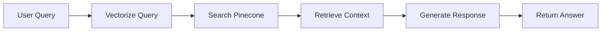

# 🚛 POC AI Express

[](https://opensource.org/licenses/MIT)
[](https://nodejs.org/)
[](https://expressjs.com/)

A sophisticated Express.js application implementing **Retrieval-Augmented Generation (RAG)** using Google's Gemini AI, Pinecone vector database, and Notion as a data source. This proof-of-concept demonstrates modern AI integration patterns with clean architecture principles.

## ✨ Features

- 🤖 **AI-Powered Responses** using Google Gemini 1.5 Flash
- 🔍 **Semantic Search** with Google AI embeddings
- 📚 **Document Retrieval** from Notion workspace
- 🗄️ **Vector Storage** via Pinecone database
- 🏗️ **Clean Architecture** with hexagonal design patterns
- 🚀 **RESTful API** with Express.js
- 🔄 **Hot Reload** development environment
- ✅ **Input Validation** with Joi schemas

## 🏛️ Architecture

This project follows **Hexagonal Architecture** (Ports & Adapters) principles:

```
📁 src/
├── 📁 modules/rag/
│   ├── 📁 application/        # Use cases & business logic
│   │   └── rag-service.js
│   ├── 📁 domain/            # Core business entities
│   │   ├── rag-core.js
│   │   └── 📁 ports/         # Interface definitions
│   │       ├── llm-service.js
│   │       └── vector-store.js
│   └── 📁 infrastructure/    # External adapters
│       ├── rag-controller.js
│       └── 📁 adapters/
│           ├── 📁 document-source/
│           ├── 📁 embeddings/
│           ├── 📁 llm/
│           └── 📁 vector-store/
```

## 🛠️ Tech Stack

### Core Technologies

- **Runtime**: Node.js (>=18.0.0)
- **Framework**: Express.js 5.1.0
- **Language**: JavaScript (ES6+)

### AI & ML Services

- **LLM**: Google Gemini 2.0-flash
- **Embeddings**: Google AI (embedding-001)
- **Vector Database**: Pinecone
- **Data Source**: Notion API

## ⚡ Quick Start

### Prerequisites

- Node.js >= 18.0.0
- Yarn or npm
- Google AI API key
- Pinecone account
- Notion integration token

### Installation

```bash
# Clone the repository
git clone https://github.com/iam-oov/poc-ai-express.git
cd poc-ai-express

# Install dependencies
yarn install

# Setup environment variables
cp .env.example .env
# Edit .env with your API keys (see Configuration section)

# Initialize Pinecone index
yarn create-index

# Load data from Notion
yarn load-notion-data

# Start development server
yarn start:dev
```

The server will start on `http://localhost:4000` (or your configured PORT).

## ⚙️ Configuration

### Environment Variables

Create a `.env` file in the root directory:

```bash
# Application
NODE_ENV=development
PORT=4000

# Google Gemini AI
GEMINI_API_KEY=your_gemini_api_key_here

# Pinecone Vector Database
PINECONE_API_KEY=your_pinecone_api_key_here
PINECONE_INDEX_NAME=your_index_name

# Notion Integration
NOTION_API_KEY=your_notion_integration_token
```

### Getting API Keys

#### 1. 🔑 Google Gemini API

1. Visit [Google AI Studio](https://makersuite.google.com/app/apikey)
2. Sign in with your Google account
3. Click "Create API Key"
4. Copy the generated key to your `.env` file

#### 2. 📌 Pinecone Setup

1. Go to [Pinecone](https://www.pinecone.io/)
2. Create a free account
3. Create a new project
4. Navigate to "API Keys" in the dashboard
5. Copy your API key and environment

#### 3. 📝 Notion Integration

1. Visit [Notion Integrations](https://www.notion.so/my-integrations)
2. Click "New integration"
3. Fill in the basic information
4. Copy the "Internal Integration Token"
5. **Important**: Share your Notion pages with the integration

## ⚙️ API Reference

### POST /ai/question

Performs RAG-based question answering using your Notion knowledge base.

**Request:**

```json
{
  "question": "dame un resumen de 50 caracteres de la carta a un tracker"
}
```

**Response:**

```json
{
  "answer": "TrackChain: Misión para redefinir la logística. ¡Sé parte!\n"
}
```

## 🧠 RAG Pipeline Flow



1. **Input Processing**: User query is received and validated
2. **Vectorization**: Query is converted to embeddings using Google AI
3. **Similarity Search**: Pinecone finds relevant document chunks
4. **Context Assembly**: Retrieved documents are formatted as context
5. **Response Generation**: Gemini generates answer based on context
6. **Output**: Structured response with sources returned to user

## 📁 Available Scripts

```bash
# Development
yarn start:dev          # Start with hot reload
yarn start              # Start production server

# Data Management
yarn create-index       # Initialize Pinecone index
yarn load-notion-data   # Load Notion pages into vector store
```

## 🔧 Development

### Project Structure

- `app.js` - Express application entry point
- `src/config/` - Application configuration
- `src/modules/rag/` - RAG implementation module
- `scripts/` - Utility scripts for data management

### Adding New Features

1. Define interfaces in `domain/ports/`
2. Implement business logic in `application/`
3. Create adapters in `infrastructure/adapters/`
4. Wire everything together in the controller

## 🤝 Contributing

1. Fork the repository
2. Create a feature branch (`git checkout -b feature/amazing-feature`)
3. Commit your changes (`git commit -m 'Add some amazing feature'`)
4. Push to the branch (`git push origin feature/amazing-feature`)
5. Open a Pull Request

## 📄 License

This project is licensed under the MIT License - see the [LICENSE](LICENSE) file for details.

## 🆘 Support

If you encounter any issues:

1. Check that all API keys are correctly configured
2. Ensure your Notion pages are shared with the integration
3. Verify that the Pinecone index has been created and populated
4. Review the console logs for detailed error messages

For additional help, please open an issue on GitHub.

---

**Made with ❤️ by [Osvaldo Hinojosa](mailto:osvaldo.javier14@gmail.com)**
